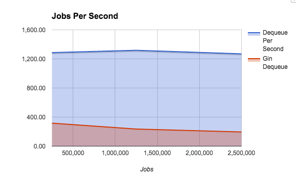

This load testing is to get a general idea of different things that impact performance. As a distributed system it can be complex to properly benchmark / load test however this should give guidance drastic differences in performance.

The typical run is 25 processes writing and 25 processes reading where each reader has 3 sub just for completeness (in a web scraper or other IO bound task this would be coroutines or threads).




Run:

| Concurrency | Jobs      | Inserts Per Second | Dequeue Per Second |
|-------------|:---------:|:------------------:|-------------------:|
| 25W/25R     | 250,000   | 1275.6833317788064 | 1287.2433412199268 |
| 25W/25R     | 1,250,000 | 1316.3065286404135 | 1318.7691477155379 |
| 25W/25R     | 2,500,000 | 1268.3089228046813 | 1270.1466037558885 |


Run with Gin Index:

```sql
CREATE INDEX queue_ids_idx ON queue USING GIN (q_name, (data #> '{ids}'::text[]));
```

| Concurrency | Jobs      | Inserts Per Second | Dequeue Per Second |
|-------------|:---------:|:------------------:|-------------------:|
| 25W/25R     | 250,000   | 314.6307633244511  | 316.26420818399646 |
| 25W/25R     | 1,250,000 | 235.29247119812302 | 235.37000080683464 |
| 25W/25R     | 2,500,000 | 195.0683681243154  | 195.09491303797395 |


